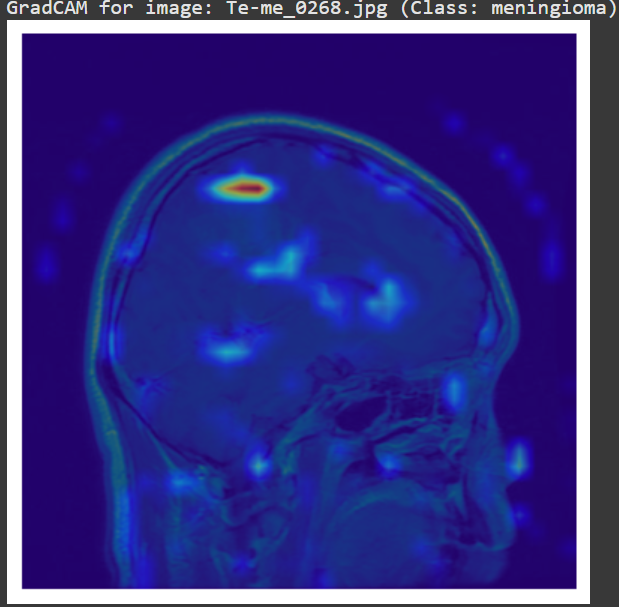

# 🧠 Brain Tumor Classification using CNN and Grad-CAM

This project focuses on classifying brain MRI images into tumor types using a **custom Convolutional Neural Network (CNN)** and visualizing model interpretability using **Grad-CAM (Gradient-weighted Class Activation Mapping)**.

---

## 🔍 Overview

* **Objective**: Automatically classify brain MRI images into four categories: `glioma`, `meningioma`, `pituitary`, and `notumor`.
* **Model Architecture**: A custom CNN built from scratch using Keras with Conv2D, MaxPooling, Dense, and Dropout layers.
* **Explainability**: The Grad-CAM technique is used to highlight regions in the MRI scans that influenced the model’s prediction.

---

## 📂 Dataset

The dataset is organized into four classes:

* `glioma`
* `meningioma`
* `pituitary`
* `notumor`

Each class is split into:

* `Training/`
* `Testing/`

> The dataset is provided as a ZIP file and extracted at runtime from Google Drive.

---


* **Optimizer**: Adam
* **Loss Function**: Categorical Crossentropy
* **Metrics**: Accuracy

---

## 📊 Evaluation Metrics

Model performance is assessed using:

* Accuracy
* Precision
* Recall
* F1 Score
* AUC (Area Under Curve)

These are summarized and compared in a results table at the end of training.
| Class          | Precision | Recall | F1-Score |
| -------------- | --------- | ------ | -------- |
| **Glioma**     | 0.9701    | 0.8667 | 0.9155   |
| **Meningioma** | 0.8527    | 0.8889 | 0.8704   |
| **Notumor**    | 0.9388    | 0.9852 | 0.9614   |
| **Pituitary**  | 0.9766    | 0.9733 | 0.9750   |


---

## 🔍 Grad-CAM Visualizations

Grad-CAM is used to visualize which parts of the input image influenced the CNN's classification decision.

### Example Output:

```python
# Heatmap for interpretability
heatmap = make_gradcam_heatmap(img_array, model, last_conv_layer_name="conv2d_1")

# Display the Grad-CAM heatmap
plt.matshow(heatmap)
plt.title("Grad-CAM Heatmap")
```

This helps in understanding **why** the model predicted a certain tumor type by highlighting important regions in the MRI image.

---
📸 Visual Results
📈 Model Accuracy and Loss Over Epochs

 - )

🔍 Grad-CAM Visualization – Notumor Class


- 


🧪 Prediction Results on Test Samples
- 

📊 Classification Report Summary


## ✅ Conclusion

* A lightweight **custom CNN** can perform well on brain MRI classification tasks with proper training.
* **Grad-CAM** adds a layer of interpretability, which is crucial in medical applications.
* The system provides accurate predictions along with **visual reasoning**, making it a reliable tool for clinical support.

